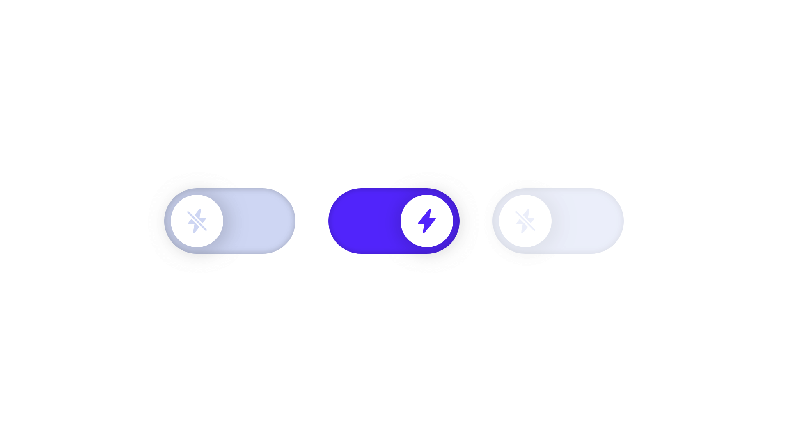

# React switch



A switch component represents a boolean state, true/false, on/off. Perfect for functionality that requires immediate feedback. It differs from a checkbox in that a checkbox has a third, indefinite state.

Use cases include changing settings, toggling between themes, etc. 

__Warning__: I'm doing this to train my frontend skills. Although it seems to be working fine for me, I didn't have the time to test things exhaustively and cannot guarantee that it will work as expected.

Also, note that __I did not test its usage within forms__. For that, you should probably use checkboxes as they are best suited for functionality that doesn't require immediate feedback.

## Usage

Make sure you have `styled-components` and `prop-types` installed. Copy the __/Switch__ folder and import __Switch__ into your project.

```javascript
import Switch from 'path/to/Switch'
import { ReactComponent as OnIcon } from 'path/to/on-icon.svg'
import { ReactComponent as OffIcon } from 'path/to/off-icon.svg'

<Switch
  label='Show bookmarks bar'
  activeStateIcon={<OnIcon />}
  inactiveStateIcon={<OffIcon />}
  onChange={(isActive) => console.log(`I'm ${isActive ? 'truthy' : 'falsy'}.`)}
/>
```

For example usage see: `/src/Demo`.

## Props

| Name | Type | Description |
| ---- | ---- | ----------- |
| `defaultActive` | boolean | Controls whether the switch starts with an active state. Defaults to false. |
| `disabled` | boolean | Controls whether the switch is non-interactive. Defaults to false. |
| `inline` | boolean | Controls whether the switch occupies only the necessary width. Defaults to false. |
| `activeStateIcon` | SVG element | Icon to be shown when the switch is in an active state. |
| `inactiveStateIcon` | SVG element | Icon to be shown when the switch is in an inactive state. |
| `label` | string | Text to be shown next to the switch. |
| `labelAlignment` | 'left' or 'right' | Controls the alignment of the label. Defaults to 'left'. |
| `ariaLabel` | string | Text for accessibility devices. You should use it if no label is provided. |
| `onChange` | function | A callback function that is invoked on every state change with true or false. |

## Styling

You can pass an object with the following shape to `ThemeProvider`:

```javascript
const theme = {
  switch: {
    background: '#ccdaf4',
    backgroundAccent: '#1f6eff',
    height: '4rem',
    width: '8rem',
    indicatorBackground: '#ffffff',
    indicatorSize: '3.2rem',
    indicatorMargin: '0 0.4rem',
    svgSize: '1.6rem'
  }
}
```

For more details and example usage, see: `/src/Demo`.
